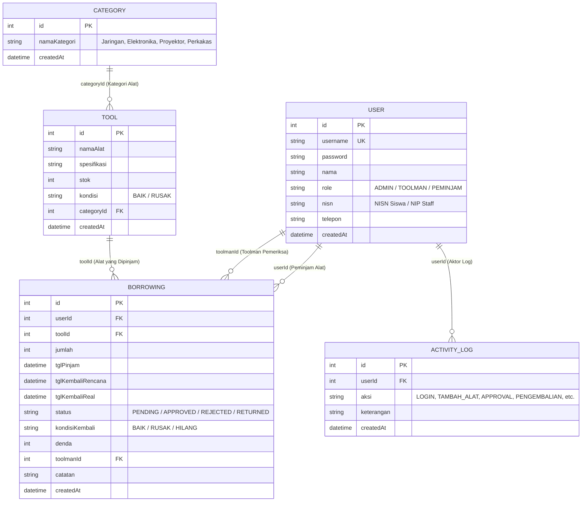

# 🔬 Sistem Peminjaman Sarpras Laboratorium RPL & Elektronika
### Aplikasi Inventaris & Sirkulasi Peralatan Praktikum Lab Komputer (Standar UKK & Industri)
**Institusi:** SMK Telkom  
**Arsitektur:** Node.js + Express.js (MVC) + Prisma ORM + SQLite + EJS + Tailwind CSS  
**Keamanan:** Session-Based Authentication & Role-Based Access Control (RBAC) 3 Level

---

## 📌 1. Latar Belakang & Skenario Masalah
Peralatan laboratorium komputer (kabel LAN tester, crimping tool, router Mikrotik, proyektor, solder, multimeter digital) sering kali tercecer, berkurang jumlahnya, atau rusak tanpa ada yang bertanggung jawab. Toolman lab kesulitan melacak siapa siswa terakhir yang meminjam alat dan kondisi fisik alat saat dikembalikan.

Aplikasi ini mendigitalkan seluruh siklus peminjaman:
1. Siswa/Guru melihat ketersediaan stok fisik dan mengajukan permohonan pinjam secara mandiri.
2. Toolman lab memverifikasi dan menyetujui (approval) permohonan, stok alat otomatis berkurang.
3. Saat alat dikembalikan, Toolman melakukan pemeriksaan fisik (Kondisi: BAIK / RUSAK / HILANG).
4. Jika alat rusak atau terlambat, sistem mencatat denda ganti rugi dan merekamnya dalam audit trail transparan.
5. Kepala Lab (Admin) memantau audit log lab, mengelola master pengguna, dan Toolman mencetak laporan resmi sirkulasi (dilengkapi media print CSS dan tanda tangan resmi).

---

## 👥 2. Tiga Level Pengguna (Role-Based Access Control)

| Role | Target Narasumber | Tugas & Wewenang Utama | Akun Demo Bawaan |
|:---|:---|:---|:---|
| **ADMIN** | Kepala Lab Komputer / IT | CRUD Master Pengguna, Master Inventaris Alat, Master Kategori, Master Transaksi, dan Memantau Audit Log Laboratorium. | `admin` / `password123` |
| **TOOLMAN** | Toolman & Laboran Lab | Menyetujui (Approval) peminjaman, memantau alat dipinjam, inspeksi kondisi fisik alat (BAIK/RUSAK), mencatat denda ganti rugi, dan mencetak laporan sirkulasi resmi. | `toolman` / `password123` |
| **PEMINJAM** | Siswa & Guru Produktif RPL | Melihat ketersediaan stok alat di lab, mengajukan permohonan pinjam alat praktikum, dan konfirmasi pengembalian alat ke meja Toolman. | `peminjam` / `password123` *(Siswa)*<br>`guru_rpl` / `password123` *(Guru)* |

---

## 🛡️ 3. Matriks Hak Akses Fitur (13 Fitur Wajib)

| No | Fitur Sistem | Admin | Toolman | Peminjam | Rute / Controller |
|:---:|:---|:---:|:---:|:---:|:---|
| 1 | Login & Logout Multi-Role | ✅ | ✅ | ✅ | `/auth/login`, `/auth/logout` |
| 2 | CRUD Data Pengguna (User) | ✅ | ❌ (403) | ❌ (403) | `/users` (userController) |
| 3 | CRUD Inventaris Alat Praktikum | ✅ | ❌ (403) | ❌ (403) | `/tools` (toolController) |
| 4 | CRUD Kategori Alat (Jaringan / Hardware) | ✅ | ❌ (403) | ❌ (403) | `/categories` (categoryController) |
| 5 | CRUD Data Peminjaman & Pengembalian | ✅ | Read/Proses | Read Sendiri | `/borrowings` (borrowingController) |
| 6 | Log Aktifitas Sistem Laboratorium | ✅ | ❌ (403) | ❌ (403) | `/activity-logs` (activityLogController) |
| 7 | Menyetujui (Approval) Peminjaman Alat | ✅ | ✅ | ❌ (403) | `POST /borrowings/:id/approve` |
| 8 | Memantau & Memproses Pengembalian Alat | ✅ | ✅ | ❌ Read Only | `GET /borrowings?status=APPROVED` |
| 9 | Pemeriksaan Fisik Alat & Input Denda Rusak | ✅ | ✅ | ❌ (403) | `GET & POST /borrowings/:id/return` |
| 10 | Mencetak Laporan Peminjaman Alat (PDF/Print) | ✅ | ✅ | ❌ (403) | `/reports` (reportController) |
| 11 | Melihat Daftar & Ketersediaan Stok Alat | ✅ | ✅ | ✅ | `/tools` |
| 12 | Mengajukan Peminjaman Alat Praktikum | ✅ | ❌ Role Siswa | ✅ | `GET & POST /borrowings/new` |
| 13 | Mengembalikan Alat ke Meja Toolman | ❌ Meja Toolman | ❌ Meja Toolman | ✅ | `POST /borrowings/:id/return-request` |

---

## 📊 4. Skema Database Relasional (Prisma ORM & SQLite)



---

## ⚡ 5. Panduan Instalasi & Menjalankan Aplikasi

### 1. Inisialisasi Dependensi
```bash
npm install
```

### 2. Konfigurasi Lingkungan (.env)
Pastikan berkas `.env` sudah terpasang:
```env
PORT=3000
DATABASE_URL="file:./dev.db"
SESSION_SECRET="sarpras-lab-rpl-elektronika-smk-telkom-secret-key-2026"
```

### 3. Sinkronisasi Database & Generate Prisma Client
```bash
npx prisma db push
```

### 4. Populasi Data Awal (Seed Data)
```bash
npm run seed
# atau
node prisma/seed.js
```

### 5. Jalankan Server Web
```bash
npm run dev
# atau
npm start
```
Buka browser di alamat: **`http://localhost:3000`**

### 6. Menjalankan Pengujian Otomatis 5 Skenario
```bash
npm test
```

---

## 🧪 6. Pengujian 5 Skenario Wajib (Dokumentasi: TEST_CASES.md)
Seluruh 5 skenario standar uji kompetensi keahlian telah diuji secara otomatis dan manual dengan hasil **100% LULUS (PASSED)**:
1. **Skenario 1:** Login user sesuai dengan hak akses (Admin, Toolman, Peminjam Siswa) & penolakan akses rute 403 Forbidden.
2. **Skenario 2:** Admin menambah inventaris alat baru (*Mikrotik RouterBoard stok 5 unit*).
3. **Skenario 3:** Siswa mengajukan peminjaman 1 unit Mikrotik untuk praktikum jaringan (*Status PENDING*).
4. **Skenario 4:** Toolman menyetujui peminjaman dan stok alat otomatis berkurang menjadi **4 unit** (*Status APPROVED*).
5. **Skenario 5:** Pengembalian alat dengan simulasi kondisi rusak, penetapan denda ganti rugi Rp 50.000, dan pencatatan riwayat audit lengkap di log aktifitas laboratorium (*Status RETURNED*).

Detail dokumentasi langkah pengujian lengkap dapat dilihat di [TEST_CASES.md](file:///c:/nopen/workshop-day-2-smk-telkom/TEST_CASES.md).

---

## 🎨 7. Fitur Antarmuka Pengguna (UI/UX)
* **Clean Modern Light Dashboard:** Dibangun dengan Tailwind CSS, Font Awesome 6, dan tipografi modern Google Font Inter.
* **1-Klik Demo Login Quick-Switch:** Tersedia tombol langsung di halaman login untuk beralih instan antara peran Admin, Toolman, dan Peminjam.
* **Indikator Badge Warna-Warni:**
  * 🟢 **Hijau:** Status `APPROVED` (Disetujui), Kondisi `BAIK`, Selesai `RETURNED`.
  * 🟡 **Kuning/Amber:** Status `PENDING` (Menunggu verifikasi Toolman), Peringatan stok menipis.
  * 🔴 **Merah/Rose:** Status `REJECTED` (Ditolak), Kondisi `RUSAK`, Terlambat, Denda ganti rugi.
* **Cetak Laporan Resmi:** Dilengkapi Kop Surat SMK Telkom, tabel rekapitulasi sirkulasi, dan kolom tanda tangan Toolman & Kepala Lab yang siap cetak / PDF via `@media print`.
